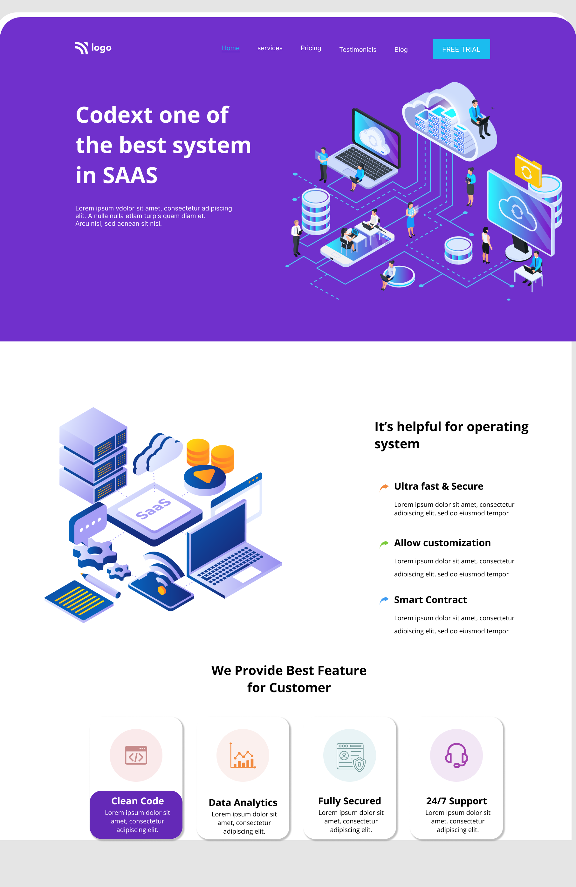

# SAAS-landing-page

# [GO LIVE](https://saas-landing-p.netlify.app)

---

## Technologies used

> HTML

> CSS

---

---

## **Skill Gained in the project**

- I Learned depth in **\*card, bacground-shadow**.
- I learned @mediaQuerry.

---

# Time taken to finish this project

- Approximately **2:50 hour** taken to complete this one.
- Nearby **3 hour** to make it responsive.

---
